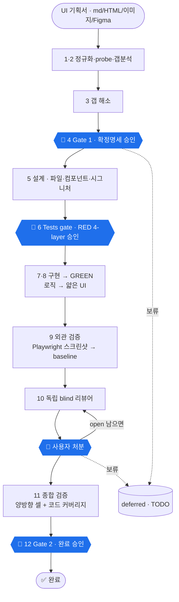
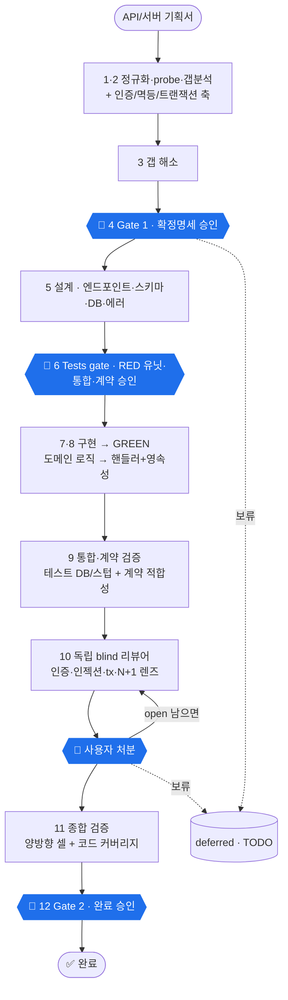

# spec-to-code

**불완전한 기획서를 완성된·검증된 코드로 바꾸는 Claude Code 플러그인.**

핵심은 기획서와 코드 *사이*의 작업 — 빈 곳을 찾아 사용자와 메우고, 결과를 증명하는 것. **확정되지 않은 기획서로는 코드를 쓰지 않습니다** (훅으로 강제).

```
어떤 포맷의 기획서 → [정규화] → [갭 발견] → [사용자와 해소] → 확정 명세 → TDD 코드 → 독립 리뷰 → 증명 문서
```

## 설치

1. 마켓플레이스 추가

```
/plugin marketplace add Seokwoodang/spec-to-code
```

2. 플러그인 설치

```
/plugin install spec-to-code@spec-to-code
```

## 업데이트

```
/plugin marketplace update spec-to-code
```

실행 후 Claude Code 재시작. 끝. (안 잡히면 `/plugin` 메뉴에서 Update, 그래도 안 되면 uninstall 후 재설치.) 기존 `/spec-to-code` 는 업데이트 후에도 그대로 작동합니다.

> 플러그인을 직접 개발/수정 중이라면 마켓 거치지 말고 로컬 폴더를 바로 물려 쓰면 편합니다 (수정 후 재시작만 하면 반영): `claude --plugin-dir <repo>/plugins/spec-to-code`

## 세 가지 전문 스킬

같은 게이트 TDD 척추를 공유하되, 검증·갭·설계는 도메인별로 전문화 (합본으로 어중간해지지 않게):

| 커맨드 | 영역 | 전문화 |
|---|---|---|
| [`/spec-to-code-frontend`](#-프론트엔드--spec-to-code-frontend) (별칭 `/spec-to-code`) | 프론트/UI | 4-layer 테스트(로직·컴포넌트·E2E·스크린샷) · 컴포넌트 설계 |
| [`/spec-to-code-backend`](#-백엔드--spec-to-code-backend) | 서버/API/DB | 통합·계약·마이그레이션 테스트 · 엔드포인트/스키마 · 인증/멱등성/트랜잭션 갭 |
| [`/spec-to-code-fullstack`](#-풀스택--spec-to-code-fullstack) | 양쪽 | 얇은 조율자 — API 계약 합의 → backend → frontend |

사용법은 기획서를 던지기만 (포맷 자유: md · HTML · PDF · 이미지/Figma · URL · 붙여넣기):

```
/spec-to-code-frontend  movie-booking.html
/spec-to-code-backend   api-spec.md
/spec-to-code-fullstack feature.md
```

---

## 공통 척추 (frontend · backend 공통)

두 스킬은 같은 **12-페이즈 게이트 TDD 흐름**을 공유합니다. 차이는 **테스트 레이어 · 검증 방법 · 설계 초점**뿐 — 각 파트에서 설명합니다. 공통 원리:

- **갭은 사용자가 결정** — 추론하지 않고 묻는다. 테스트로 못 쓸 만큼 모호하면 그것도 갭.
- **`00-behavior-grid.md` 필수** — 축(입력·상태·역할·외부호출 결과…)×값을 카르테시안 곱으로 **빈 칸 없이** 채운 격자. 테스트 커버리지의 단위(셀). 이게 있어야 `02-resolved-spec.md` 를 쓸 수 있음(훅 강제). 멀티스크린/멀티엔드포인트면 `gap-hunter` 팬아웃 + 적대적 크리틱 필수.
- **양방향 커버리지** — *모든 기획서 동작 → ≥1 셀* (forward) **그리고** *모든 셀 → ≥1 테스트* (back). 둘 다 확인해 빠진 동작·안 짠 테스트를 모두 잡음.
- **게이트는 문서로** — 하드스톱마다 MD 파일을 만들어 경로를 주고, 당신이 읽고 승인/수정. 채팅 표 아님.
- **훅으로 강제** — 설계(`03-design.md`) 승인 전엔 코드/테스트 작성 차단, 리뷰 승인 전엔 완료 문서 차단 (scoped·fail-open).
- **독립 blind 리뷰** — 작성자가 아닌 리뷰어가 *이전 라운드도 안 보고* 매 라운드 새로 발견 + 별도 non-blind closure 확인.
- **모든 산출 문서는 한글.** 코드·식별자·파일명·셀 이름은 영어.

**사용자 개입은 세(+리뷰 루프) 군데** — 나머지 갭조사·구현·검증은 자동:

| 체크포인트 | 받는 것 | 하는 것 |
|---|---|---|
| 🚪 **Gate 1** (코딩 전) | 갭 질문 → `02-resolved-spec.md` | 빈 곳 답하고 → 파일 승인 |
| 🚪 **Tests gate** (구현 전) | `03-design.md` + RED 테스트 | 설계·테스트 읽고 → 승인 |
| 🔁 **리뷰 루프** (반복) | `06-review/r1.md…` (독립 리뷰) | finding별 fix/defer/reject → 통과까지 |
| 🚪 **Gate 2** (완료) | `08-completion.md` + 검증 | 최종 승인 (커밋은 명시 지시 때만) |

> "꼼꼼히/단계별로" 라고 하면 설계·구현·검증도 각각 멈추는 **step-through** 모드. 작은 변경은 자동으로 **lite**(4단계·1게이트).
> **"문서까지만 / 구현은 하지마 / 설계+테스트만"** → **docs scope**: Phase 6까지(확정명세·설계·테스트계획 + RED 테스트)만 만들고 멈춤. 다른 사람/도구가 GREEN만 만들면 됨.

---

## 🖥 프론트엔드 — `/spec-to-code-frontend`

UI 기획서(화면·컴포넌트·상태)를 받아 **상태→화면 매핑과 인터랙션**을 증명하는 흐름.



| # | 페이즈 | 산출 파일 | 정지 |
|---|--------|------|------|
| 1 | 정규화 & probe | `01-working-spec.md` + 환경/모드/tier 판정 | — |
| 2 | 갭 분석 | `00-behavior-grid.md` — 전체 동작 격자 (빈 칸 없이) | — |
| 3 | 갭 해소 | `02-resolved-spec.md` | — |
| 4 | **🚪 Gate 1** | 확정 명세 승인 | **하드스톱** |
| 5 | 설계 | `03-design.md`(파일·컴포넌트·함수 시그니처·동작) + `05-traceability.md`(draft) | 🟠 |
| 6 | **🚪 Tests gate** | `04-test-doc.md` + **RED 테스트(4-layer)**, 구현 전 승인 | **하드스톱** |
| 7 | 로직 구현 | 로직 테스트 GREEN | 🟡 |
| 8 | UI 구현 | 컴포넌트·플로우 테스트 GREEN | 🟡 |
| 9 | 외관 검증 | Playwright 스크린샷 → baseline | 🟠 |
| 10 | **🔁 리뷰 루프** | `06-review/r<k>.md`, 통과까지 | **하드스톱** |
| 11 | 종합 검증 | `05-traceability.md` 채움 + `07-verify.md` | — |
| 12 | **🚪 Gate 2** | `08-completion.md` + 패키지 | **하드스톱** |

**이 영역의 특징**
- **테스트 = 4-layer 피라미드** (`references/verification.md`):
  1. **로직** (순수, Vitest/Jest — DOM 없음)
  2. **컴포넌트 렌더** (Testing Library + jsdom — *컴포넌트 격리*: props→출력, 조건부 렌더, 핸들러 배선. UI 테스트의 대부분)
  3. **UI 플로우** (Playwright E2E — 컴포넌트 간 여정·라우팅·포커스·실네트워크)
  4. **외관** (스크린샷 — 픽셀·정렬. 사람이 baseline 승인 후 drift 자동 차단)
- **Phase 9 = 외관 검증** — 상태별 스크린샷을 Gate 2에서 bless → 이후 시각 drift 자동 실패.
- **설계 초점** — 파일·컴포넌트 분해, props/state, 핸들러, HTML 입력이면 컴포넌트 분해.
- **코드 커버리지** — 로직+컴포넌트 레이어 계측, **branch 중심**, 순수 로직 모듈 ≥90% (진단 중심).

---

## ⚙️ 백엔드 — `/spec-to-code-backend`

서버/API/DB 기획서를 받아 **계약·인증·데이터·실패 동작**을 증명하는 흐름.



| # | 페이즈 | 산출 파일 | 정지 |
|---|--------|------|------|
| 1 | 정규화 & probe | `01-working-spec.md` + 환경(러너·**DB**·프레임워크) 판정 | — |
| 2 | 갭 분석 | `00-behavior-grid.md` — 전체 동작 격자 (**+ 백엔드 필수 축**) | — |
| 3 | 갭 해소 | `02-resolved-spec.md` | — |
| 4 | **🚪 Gate 1** | 확정 명세 승인 | **하드스톱** |
| 5 | 설계 | `03-design.md`(엔드포인트·스키마·DB·에러모델) + `05-traceability.md`(draft) | 🟠 |
| 6 | **🚪 Tests gate** | `04-test-doc.md` + **RED 테스트(유닛·통합·계약)**, 구현 전 승인 | **하드스톱** |
| 7 | 로직 구현 | 도메인 로직 유닛 테스트 GREEN | 🟡 |
| 8 | API 구현 | 핸들러+영속성, 통합·계약 테스트 GREEN | 🟡 |
| 9 | 통합·계약 검증 | 테스트 DB/스텁 대상 suite + 계약 적합성 | 🟠 |
| 10 | **🔁 리뷰 루프** | `06-review/r<k>.md`, 통과까지 | **하드스톱** |
| 11 | 종합 검증 | `05-traceability.md` 채움 + `07-verify.md` | — |
| 12 | **🚪 Gate 2** | `08-completion.md` + 패키지 | **하드스톱** |

**이 영역의 특징**
- **테스트 = 3-layer** (`references/verification.md`):
  1. **로직** (순수 유닛 — DB/HTTP import 없음)
  2. **통합** (테스트 DB, 마이그레이션 적용 — 영속성·제약·**트랜잭션 롤백·부분쓰기 없음**)
  3. **API 계약** (실제 엔드포인트 — HTTP 상태·바디 형태·**머신 에러코드**가 명세와 일치)
- **Phase 2 갭 분석에 백엔드 필수 축** — 인증/인가 · 입력검증 · **멱등성** · **트랜잭션/일관성** · **동시성/락** · rate limit · 페이지네이션 계약 · **에러 모델**(상태코드+머신코드) · 외부호출 실패(timeout/retry).
- **Phase 9 = 통합·계약 검증** — 실제 테스트 DB(또는 스텁) 대상으로 suite 실행, 계약 적합성 확인.
- **설계 초점** — 엔드포인트(method/path/auth), req/res 스키마+에러코드, DB 스키마+마이그레이션, 트랜잭션 경계.
- **마이그레이션** — 파괴적 자동 실행 금지. 가역·additive로 설계해 사용자가 적용.
- **코드 커버리지** — 유닛+통합 레이어 계측, branch 중심, 순수 로직 ≥90%.

---

## 🔗 풀스택 — `/spec-to-code-fullstack`

**얇은 조율자** — 자체 검증 없음. ① 두 영역이 공유할 **API 계약(`api-contract.md`)** 을 사용자와 합의 → ② `spec-to-code-backend` 실행 → ③ `spec-to-code-frontend` 실행. 각 절반은 위에서 설명한 **자기 12-페이즈 흐름을 그대로** 돕니다(각자 게이트·훅·버전 폴더·deferred). 한쪽이 계약을 바꿔야 하면 `api-contract.md` 를 고쳐 양쪽에 다시 알림 — 조용히 어긋나지 않게.

```
feature.md → [API 계약 합의] → backend 전체 실행 → frontend 전체 실행
```

---

## 산출물 저장 구조

기능별 `docs/spec-to-code/<slug>/` 에 **버전 폴더**로 저장 (마크다운, 워크플로우 순서대로 번호):

```
docs/spec-to-code/<slug>/
├── index.md · CHANGELOG.md · deferred.md(TODO) · source/   # 공통 (버전 무관)
└── v1/  00-behavior-grid · 01-working-spec · 02-resolved-spec · 03-design
       04-test-doc · 05-traceability · 06-review/ · 07-verify · 08-completion
```

코드·테스트는 doc home이 아니라 프로젝트 자체 위치에. 업데이트는 `v2/` 생성 후 직전 버전과 diff (전체 suite 회귀 검사).

### 각 파일의 역할

**버전별 (`v<N>/`)** — 워크플로우 순서대로. *(FE/BE 차이는 위 각 파트의 "특징" 참고)*

| 파일 | 역할 | 게이트 |
|---|---|---|
| `00-behavior-grid.md` | **전체 동작 격자.** 축×값 카르테시안 곱을 **빈 칸 없이** 결정한 결정표/상태×이벤트 매트릭스. *기획서의 구멍만이 아니라 전체 동작을 분해한 것*이며 테스트 커버리지의 단위(셀). | (hook이 02 전 강제) |
| `01-working-spec.md` | 어떤 포맷이든 정규화한 **기획서 스냅샷** — 업데이트 diff 기준선. | — |
| `02-resolved-spec.md` | 갭을 사용자와 해소한 **확정 명세** (결정·케이스·엣지·에러). | 🚪 Gate 1 |
| `03-design.md` | **완전한 개발 문서** — FE: 파일·컴포넌트·시그니처 / BE: 엔드포인트·스키마·DB·에러모델. | 🚪 Tests gate |
| `04-test-doc.md` | 테스트 **계획→리포트** + QA가 코드 없이 읽는 **per-test 명세**(검증목적·전제조건·스텝·기대결과·🔍수동 QA·의심 변형) + **코드 커버리지 수치·미커버 분류**. | 🚪 Tests gate |
| `05-traceability.md` | **양방향 커버리지 증명** — 기획서 동작 ↔ 셀 ↔ 테스트 ↔ 코드 (빈 칸 = 미완성). | (Gate 2 전 채움) |
| `06-review/r<k>.md` | **라운드별 독립 리뷰** — blind 발견(이전 라운드 안 봄) + non-blind closure 확인. 모든 라운드 보존. | 🔁 리뷰 루프 |
| `07-verify.md` | **종합 검증** — 양방향 셀 커버리지 · 코드 커버리지 · 적합성 · 추적성 · 로직-IO 분리 감사. | (Gate 2 전) |
| `08-completion.md` | **완료 요약** — 실행법, 검증 결과, 잔여 항목. | 🚪 Gate 2 |

**공통 (slug 루트, 버전 무관)**:

| 파일 | 역할 |
|---|---|
| `index.md` | 산출물 목차/매니페스트 |
| `CHANGELOG.md` | 버전별 변경 로그 |
| `deferred.md` | 보류·TODO 파킹랏. 연동 대기 항목은 **Where(어디 stub)·What(뭐가 빠짐)·Done-when(언제 풀림)** 상세 블록 — 무엇도 조용히 누락되지 않게 |
| `source/` | 원본 기획서 원문 보관 |

📖 **실제 런 예시**: [`examples/example-run-product-search.md`](plugins/spec-to-code/examples/example-run-product-search.md) — 불완전한 4줄 기획서 → 검증된 React 코드 전 과정.

## 구조

```
.claude-plugin/marketplace.json
plugins/spec-to-code/
├── .claude-plugin/plugin.json
├── commands/        spec-to-code.md  (frontend 별칭; -backend/-fullstack은 스킬로 호출)
├── agents/          gap-hunter · code-reviewer · spec-verifier  (읽기전용)
├── hooks/           gate-guard.mjs  (게이트 강제)
└── skills/          spec-to-code-{frontend,backend,fullstack}/
                     각 SKILL.md + references/ (상세) + scripts/
```
자세한 플로우·룰·산출물 규격은 각 스킬의 `SKILL.md` 와 `references/` 에 있습니다.

## 기여 / 업데이트

스킬·에이전트 수정 → `plugin.json` 의 `version` 올리고 `git push`. push하면 마켓플레이스에 반영되고, 사용자는 `/plugin` 메뉴에서 업데이트.
