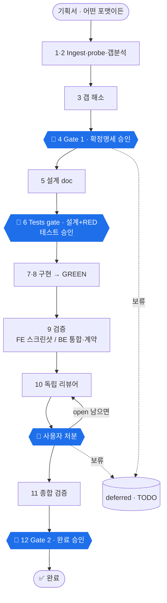

# spec-to-code

**불완전한 기획서를 완성된·검증된 코드로 바꾸는 Claude Code 플러그인.**

핵심은 기획서와 코드 *사이*의 작업 — 빈 곳을 찾아 사용자와 메우고, 결과를 증명하는 것. **확정되지 않은 기획서로는 코드를 쓰지 않습니다** (훅으로 강제).

```
어떤 포맷의 기획서 → [정규화] → [갭 발견] → [사용자와 해소] → 확정 명세 → TDD 코드 → 독립 리뷰 → 증명 문서
```

## 설치

```
/plugin marketplace add Seokwoodang/spec-to-code
/plugin install spec-to-code@spec-to-code
```
**업데이트** — `/plugin marketplace update spec-to-code` 실행 후 Claude Code 재시작. 끝. (안 잡히면 `/plugin` 메뉴에서 Update, 그래도 안 되면 uninstall 후 재설치.) 기존 `/spec-to-code` 는 업데이트 후에도 그대로 작동합니다.

> 플러그인을 직접 개발/수정 중이라면 마켓 거치지 말고 로컬 폴더를 바로 물려 쓰면 편합니다 (수정 후 재시작만 하면 반영): `claude --plugin-dir <repo>/plugins/spec-to-code`

## 세 가지 전문 스킬

같은 게이트 TDD 척추를 공유하되, 검증·갭·설계는 도메인별로 전문화 (합본으로 어중간해지지 않게):

| 커맨드 | 영역 | 전문화 |
|---|---|---|
| `/spec-to-code-frontend` (별칭 `/spec-to-code`) | 프론트/UI | Playwright UI동작·스크린샷 · 컴포넌트 설계 |
| `/spec-to-code-backend` | 서버/API/DB | 통합·계약·마이그레이션 테스트 · 엔드포인트/스키마 · 인증/멱등성/트랜잭션 갭 |
| `/spec-to-code-fullstack` | 양쪽 | 얇은 조율자 — API 계약 합의 → backend → frontend (각 절반 그대로 전문 실행) |

단일 영역은 front/back 직접, 양쪽은 fullstack. `/spec-to-code` 는 frontend 별칭(기존 호환).

## 사용법

기획서를 던지기만 하면 됩니다 (포맷 자유: md · HTML · PDF · 이미지/Figma · URL · 붙여넣기):

```
/spec-to-code-frontend  movie-booking.html
/spec-to-code-backend   api-spec.md
/spec-to-code-fullstack  feature.md
```

이후 **사용자가 개입하는 건 세 군데** (나머지 갭조사·구현·검증은 자동). 각 게이트는 **문서 파일을 열어 읽고 승인/수정**:

| 체크포인트 | 받는 것 | 하는 것 |
|---|---|---|
| 🚪 **Gate 1** (코딩 전) | 갭 질문 → `02-resolved-spec.md` | 빈 곳 답하고 → 파일 승인 |
| 🚪 **Tests gate** (구현 전) | `03-design.md` + RED 테스트 | 설계·테스트 읽고 → 승인 |
| 🔁 **리뷰 루프** (반복) | `06-review/r1.md…` (독립 리뷰) | finding별 fix/defer/reject → 통과까지 |
| 🚪 **Gate 2** (완료) | `08-completion.md` + 검증·스크린샷 | 최종 승인 (커밋은 명시 지시 때만) |

> "꼼꼼히/단계별로" 라고 하면 설계·구현·UI도 각각 멈추는 **step-through** 모드. 작은 변경은 자동으로 **lite**(4단계·1게이트).
> **"문서까지만 / 구현은 하지마 / 설계+테스트만"** 이라고 하면 **docs scope** — Phase 6까지(확정명세·설계·테스트계획 + RED 테스트)만 만들고 멈춤. 구현은 안 하고(훅이 막은 채) 문서+실패테스트를 핸드오프 → 다른 사람/도구가 GREEN만 만들면 됨.

## 동작 방식

아래 흐름은 **frontend·backend 공통(12 페이즈 척추)** 입니다. **fullstack은 다름** — 12페이즈를 직접 돌지 않고 *API 계약 합의 → backend 실행 → frontend 실행* 으로 두 스킬을 조율합니다.



| # | 페이즈 | 산출 | 정지 |
|---|--------|------|------|
| 1 | Ingest & probe | working spec + 환경/모드/tier 판정 | — |
| 2 | 갭 분석 | 갭 목록 (전수) | — |
| 3 | 갭 해소 | `02-resolved-spec.md` | — |
| 4 | **🚪 Gate 1** | 확정 명세 승인 | **하드스톱** |
| 5 | 설계 | `03-design.md`(완벽한 개발문서) + `05-traceability.md` | 🟠 |
| 6 | **🚪 Tests gate** | RED 테스트 + `04-test-doc.md`, 구현 전 승인 | **하드스톱** |
| 7 | 로직 구현 | 로직 테스트 GREEN | 🟡 |
| 8 | UI/API 구현 | 동작 테스트 GREEN | 🟡 |
| 9 | 검증 | FE: Playwright 스크린샷 / BE: 통합·계약 | 🟠 |
| 10 | **🔁 리뷰 루프** | 독립 리뷰어 → `06-review/r<k>.md`, 통과까지 | **하드스톱** |
| 11 | 종합 검증 | `05-traceability.md` 채움 + `07-verify.md` | — |
| 12 | **🚪 Gate 2** | `08-completion.md` + 패키지 보고 | **하드스톱** |

(🔴 4·6·10·12 = checkpoint 모드 하드스톱 · 🟠🟡 5·7·8·9 = step-through에서 추가 정지 · 1·2·11 = 안 멈춤)

- **갭은 사용자가 결정** — 추론하지 않고 묻는다. 테스트로 못 쓸 만큼 모호하면 그것도 갭.
- **게이트는 문서로** — 각 하드스톱마다 MD 파일을 만들어 경로를 주고, 당신이 읽고 승인/수정. 채팅 표 아님.
- **훅으로 강제** — 설계(`03-design.md`) 승인 전엔 코드/테스트 작성이 차단됨 (scoped·fail-open).
- **독립 리뷰** — 별도 컨텍스트 리뷰어가 라운드마다 새로 리뷰 (작성자 self-review 금지).
- **fresh / update** (이전 산출물 유무) · **full / lite** (규모) 자동 판별. 업데이트는 전체 suite 회귀 검사.

## 산출물

기능별 `docs/spec-to-code/<slug>/` 에 **버전 폴더**로 저장 (마크다운, 워크플로우 순서대로 번호):

```
docs/spec-to-code/<slug>/
├── index.md · CHANGELOG.md · deferred.md(TODO) · source/   # 공통
└── v1/  01-working-spec · 02-resolved-spec · 03-design · 04-test-doc
       05-traceability · 06-review/ · 07-verify · 08-completion
```
코드·테스트는 doc home이 아니라 프로젝트 자체 위치에. 업데이트는 `v2/` 생성 후 직전 버전과 diff.

📖 **실제 런 예시**: [`examples/example-run-product-search.md`](plugins/spec-to-code/examples/example-run-product-search.md) — 불완전한 4줄 기획서 → 검증된 React 코드 전 과정.

## 구조

```
.claude-plugin/marketplace.json
plugins/spec-to-code/
├── .claude-plugin/plugin.json
├── commands/        spec-to-code(-frontend/-backend/-fullstack).md
├── agents/          gap-hunter · code-reviewer · spec-verifier  (읽기전용)
├── hooks/           gate-guard.mjs  (게이트 강제)
└── skills/          spec-to-code-{frontend,backend,fullstack}/
                     각 SKILL.md + references/ (상세) + scripts/
```
자세한 플로우·룰·산출물 규격은 각 스킬의 `SKILL.md` 와 `references/` 에 있습니다.

## 기여 / 업데이트

스킬·에이전트 수정 → `plugin.json` 의 `version` 올리고 `git push`. push하면 마켓플레이스에 반영되고, 사용자는 `/plugin` 메뉴에서 업데이트.
